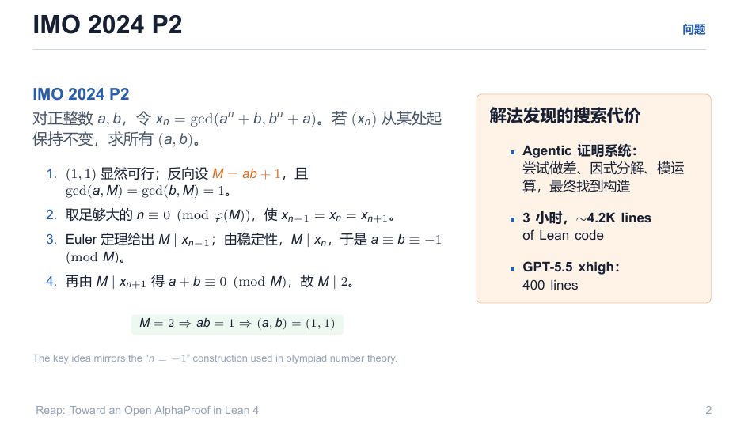
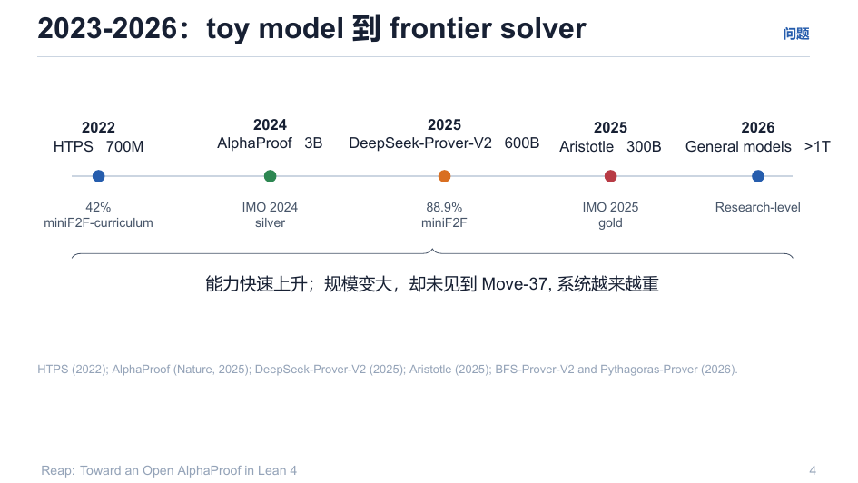
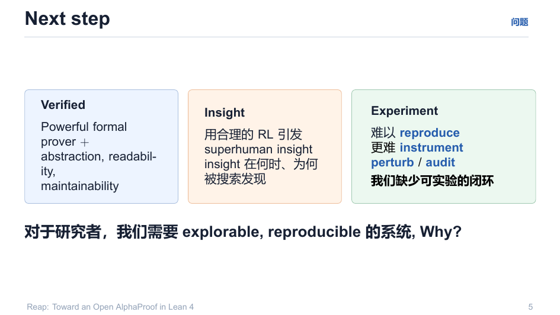
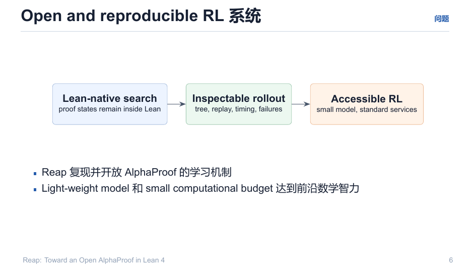

# 00 · 什么是 Reap

> 一句话：**Reap = 用轻量模型 + 小预算，把 AlphaProof 的"搜索 + 自我改进"机制复现成一个可运行、可观察、可实验的 Lean 4 系统。**

回目录：[wiki 首页](README.md)

---

## 1. 问题：搜索背后的"高杠杆一步"

IMO 2024 P2（正整数 $a,b$，令 $x_n = \gcd(a^n+b,\,b^n+a)$，若数列从某处起不变，求所有 $(a,b)$）：

- 人类证明的关键步骤：**注意到构造 $M = ab+1$**——这是整个证明的高杠杆"直觉"；
- 一个 agentic 证明系统：3 小时，约 4200 行 Lean；
- GPT-5.5 xhigh：约 400 行；
- AlphaProof 的公开输出：**88 行**，且不依赖自然语言，3B 模型在形式化搜索中找到同款构造（称 "Move 37"）。

**启发**：能力差距不只来自模型大小，更来自**系统是否把"insight 的搜索"做成了可学习、可复验的算法**。

## 2. 规模曲线：变大 ≠ 变聪明

2022 年 HTPS 700M → 2024 AlphaProof 3B → 2025 DeepSeek-Prover-V2 600B / Aristotle 300B → 2026 通用模型 >1T：

- 能力快速上升（miniF2F 42% → 88.9%，IMO 银牌 → 金牌 → research-level）；
- 但**未见 Move-37**，且系统越来越重、难以复现、难以 instrument、难以 perturb/audit。

## 3. 结论：需要可实验的闭环

对于研究者，需要一个 **explorable, reproducible** 的系统：

1. **Lean-native search**：证明状态始终留在 Lean 内部；
2. **Inspectable rollout**：树、回放、时序、失败可导出；
3. **Accessible RL**：小模型 + 标准服务（OpenAI 兼容端点）。

Reap 的承诺：**复现并开放 AlphaProof 的学习机制**——用 lightweight model + small computational budget 达到前沿数学智力。

## 4. 三个锚点

| 锚点 | 含义 | 对应仓库部件 |
|---|---|---|
| 搜索在 Lean 内 | 证明状态不外串；无 Python 循环猜测 | `Reap.Tactic.*`、`Reap.TreeSearch.*` |
| 一切可观察 | 树、value、visit、premise、wall-clock 可导出；失败本身是工件 | `RolloutSink`、`v1_sink.py` |
| 训练可接入 | policy/value endpoint + `/ttt_step` 在线更新钩子 | `app/policy_server.py`、`app/value_head.py` |

## 5. Reap 是什么、不是什么

- **是**：环境 + 搜索 harness。Lean 侧维护状态、执行动作、验证证明、运行 MCTS；
- **不是**：训练器本身——它不含梯度与参数更新（模型权重由部署环境注入，本仓库只提供端点与训练钩子）；
- 本仓库补上的正是**训练侧**：`app/`（policy server + value head + TTT）、`v1-spec/`（协议与训练方法）、`plan/`（参数更新循环设计）。

---

## 溯源

- 演示文稿：`reap_tactic.pdf` 第 1–6 页（本页插图为 deck-02/04/05/06）；
- 深度分析：`explain/2-hard-problem如何进步.md`（难度形式化 $\log B = \Theta(L^*)$）、`plan/01-motivation.md`；
- 版本口径：`explain/7-reap-v1-v2.md`（upstream / V1 Reap.Training / V2 Reap.Agent）。
