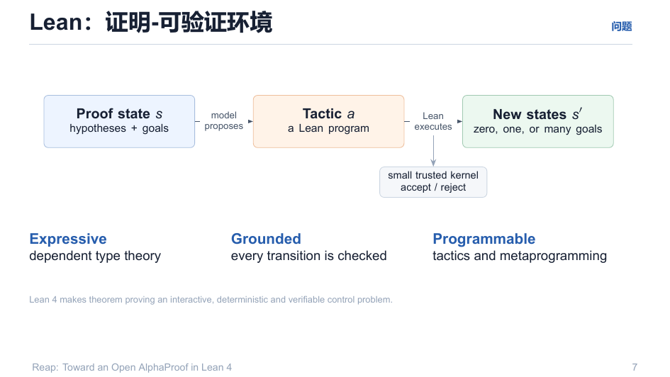

# 01 · Lean 作为验证环境

> 定理证明 = 一个**交互式、确定性、可验证的博弈/控制问题**。Lean 是棋盘，kernel 是裁判。

回目录：[wiki 首页](README.md) ｜ 下一篇：[MCTS 核心](03-mcts-core.md)

---

## 1. 闭环语义（一段话）

```
Proof state s (hypotheses + goals)
   │  模型提出 Tactic a（自然语言外衣下的 Lean 程序）
   ▼
Lean 执行 a  →  新状态 s′（零个/一个/多个子目标）
   │
   ▼
小、可信 kernel 接受或拒绝
```



关键点在三个形容词：

| 性质 | 含义 | 收益 |
|---|---|---|
| **Expressive** | dependent type theory | 定理表述全部可被直接编码 |
| **Grounded** | 每步转移都被内核检查 | 搜索动作有物理意义的"价格" |
| **Programmable** | tactics + metaprogramming | 动作空间本身是语言，可分层、可组合 |

## 2. 判定分类（系统如何说"不"）

验证器（`Reap/Tactic/Step.lean` 语义，见 `v1-spec/02-mcts-verifier.md`）输出**结构化 verdict**：

```
parseError | forbidden | tacticException | tacticTimeout
| tacticErrorMessages | unassignedGoal | assignedProofHasMVarOrSorry
| auxProofHasMVarOrSorry | auxProofKernelCheckFailed | finalProofCheckFailed
```

- **parseError / forbidden**：动作根本不是合法 Lean 语法；
- **unassignedGoal / MVar**：看似"通过"但洞未闭环 → 一律拒绝；
- **aux-proof kernel check**：辅助声明也要内核终检 — 堵住"偷偷 sorry / 塞一个定理当证明"。
- 最终 reward：只有存在一条 root→leaf 全 solved 路径（`checkProof` 全部通过）才得 $r=+1$。

## 3. 为什么"kernel 反馈"能当奖励

围棋中，环境给出胜负；**Lean 中，kernel 给出确定性的编译器反馈**。

- 奖励是**稀疏的**：终局 $\{0,1\}$，路径上几乎处处 0——所以中间信息要靠 value head 转导（见 [03](03-mcts-core.md)）；
- 反馈是**确定的**：同一 (state, tactic) 永远同 verdict——这给了搜索**可重放性**（replay，见 [06](06-rollout-pipeline.md)）。

## 4. 搜索空间的形状（与围棋的差别）

| | Go | Lean |
|---|---|---|
| 动作空间 | 固定 $\le 361$ 落点 | **开放式语言动作**，近似无穷（`constructor`、`have h : ... := by ...`、`nlinarith [...]`…） |
| 节点类型 | 单玩家树 | **OR/AND 混合**：子目标要全部解决 |
| 状态数 | 有限 | 实际无限（每个 pretty-print 状态都可扩） |

这些差别直接推动 MCTS 的两处 Lean 化改造：**progressive sampling**（见 [03](03-mcts-core.md) §2）与 **AND/OR 语义**（见 [03](03-mcts-core.md) §3）。

---

## 溯源

- 演示文稿：`reap_tactic.pdf` 第 7 页；
- 规格：`v1-spec/02-mcts-verifier.md`（verdict 枚举、切音 `checkProof` 语义）；
- 原始说明：`explain/reap-mcts-lean-v1/00-overview.md`（验证器不可剪枝）、`05-quality-gates.md`（评审门）。
