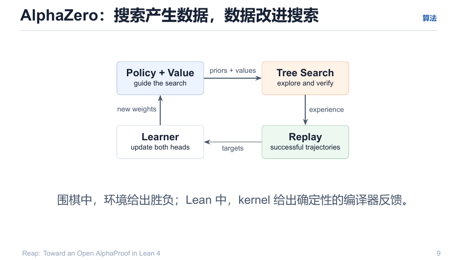
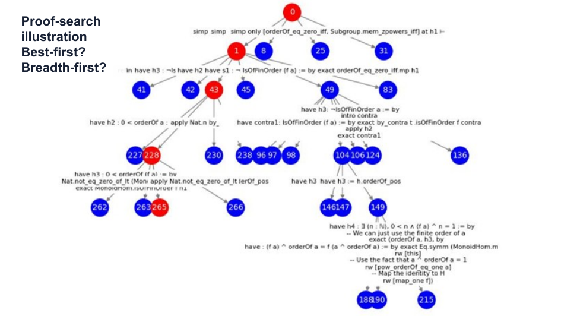

# 02 · 搜索-数据循环：算法不只是求解器

> MCTS 在这里**首要角色是学习信号的生产机器**，其次才是求解器。
> 搜索产生数据，数据改进搜索——AlphaZero 的核心回路，在 Lean 上的版本。

回目录：[wiki 首页](README.md) ｜ 上一篇：[Lean 环境](01-lean-environment.md) ｜ 下一篇：[MCTS 核心](03-mcts-core.md)

---

## 1. AlphaZero 标准回路

```
Policy + Value (priors + values 引导搜索)
   → Tree Search（探索并验证：Lean 侧 = 确定性 kernel 验证）
   → 经验（轨迹 / replay 数据）
   → Learner（更新两个头）
   → 新权重 → 更强的搜索 → 更好的 target → 更强的模型   （循环）
```



**围棋与 Lean 的同一性**：环境给出胜负（围棋）/ kernel 给出确定性编译器反馈（Lean）。二者都封闭——搜索、验证、学习全在同一自洽环内。

## 2. 树长什么样

一次 IMO 风格证明搜索的层级结构（数字 = 访问计数，红 = 关键路径）：



- 问题"Best-first? Breadth-first?"的答案在 Reap 中是**PUCT 混合**：近于 best-first（价值优先）但保留先验×探索项，单轨贪心与纯 BFS 都是退化情形（对照见 `explain/10-mcts-usage-and-alternatives.md` 第 4 节：BestFirst / A* / Beam / 进化 / BFS 逐一排除分析）。

## 3. V1 中的三重职能

$$
\text{MCTS} = \underbrace{\text{rollout collection}}_{\text{策略-验证轨迹}} \oplus \underbrace{\hat Q(s,a)\ \text{每步价值}}_{\text{搜索回传给价值头}} \oplus \underbrace{\text{在线更新触发}}_{\text{buffer → ttt\_step}}

$$

即 `v1-spec/00-overview.md` 的数据流：

```
题目池 batch.jsonl
 → BatchSolver → reapMCTS（policy / value / PS 三 endpoint）
    └─ RolloutSink（每节点：state, tactic, EvalError, logprob, value, parent, depth）
        ├→ solutions.jsonl  （kernel 验证通过的证明脚本 + 树）
        ├→ failures.jsonl   （失败轨迹：错误/超时/违规）
        └→ rttt_buffer.jsonl（流式给 policy_server /ttt_step）
 → trainer 消费 solutions/failures（GRPO / TTT 数据）
```

**关键读数**：RTTT 与 MCTS 是在线同一循环——值头在搜索进行中就被更新（$V \leftarrow V+\alpha_V\,(G_t - V)$），然后搜索继续，下一节点用已更新的值选择。只有"树 + 搜索访问统计"能支撑这种"边搜索边学"（单轨 rollout 没有价值回传事件，无从在线更新）——MCTS 是 TTT 的**事件发生器**。

## 4. 一个反直觉推论：policy 越小，越需要这个循环

- 弱 policy 可以用**更多搜索**弥补：$\text{solve-rate} \approx f(\text{model quality}) \circ g(\text{search budget})$；AlphaProof 报告倍增搜索深度约换 10x 求解率（超线性）；
- 小模型让 RL 迭代以分钟计而非天计 → 小预算可以真的跑通整个回路（`plan/01-motivation.md` §1.3）。

---

## 溯源

- 演示文稿：`reap_tactic.pdf` 第 8–10 页；
- 数据流/事件：`v1-spec/00-overview.md`（组件图与信息流）；
- 深度论证：`explain/10-mcts-usage-and-alternatives.md`（MCTS = 值-策略-验证三者焊点）、`explain/11-selfplay-alpha-zero-vs-reap-ttt.md`（self-play vs 教师/验证闭环）。
