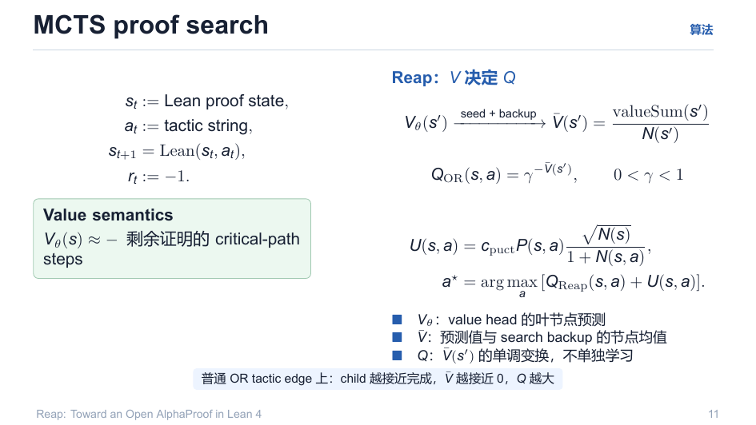
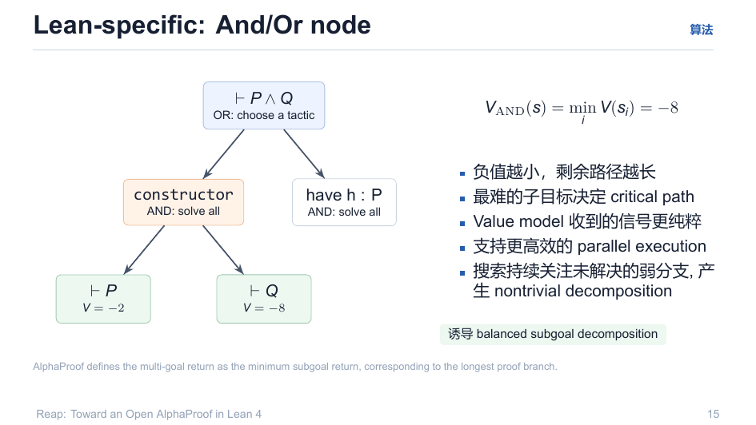
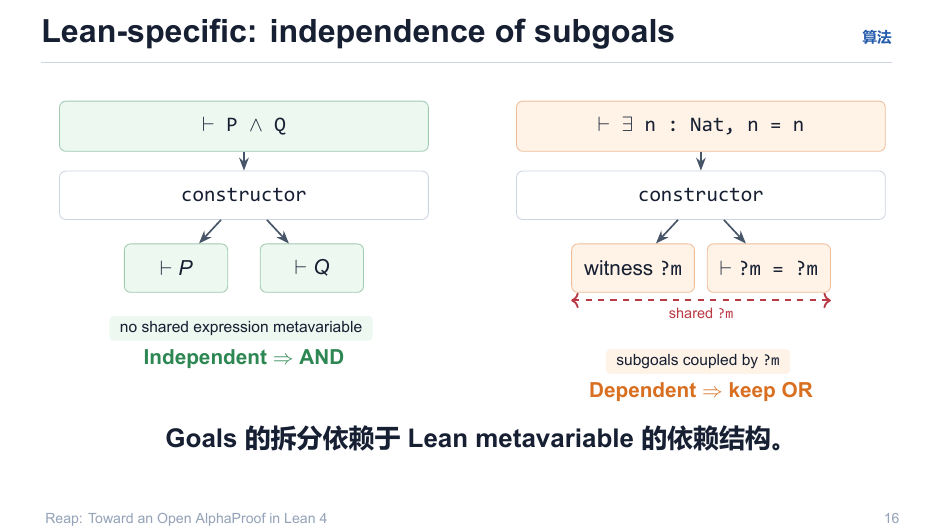
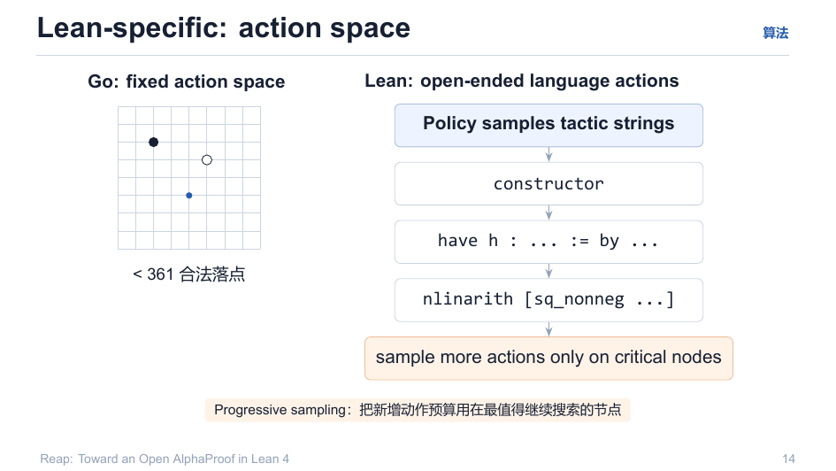

# 03 · MCTS 核心算法

> 数学上最密集的一页。核心一句话：**Reap 用 V 决定 Q**——价值模型刻画"离证明还有多远"，PUCT 融合价值与策略先验，AND/OR 语义精确表达逻辑必然。

回目录：[wiki 首页](README.md) ｜ 上一篇：[搜索-数据循环](02-search-data-loop.md) ｜ 下一篇：[训练目标](04-training-objective.md)

---

## 1. 基本记号

$$
s_t := \text{Lean proof state},\qquad a_t := \text{tactic string},\qquad s_{t+1} = \mathrm{Lean}(s_t, a_t),\qquad r_t := -1
$$

**价值语义（先想清楚 V 是什么）**：

$$
V_\theta(s) \approx -\ \text{剩余证明的 critical-path steps}
$$

**负值越小，剩余路径越长**（之后会看到为什么负值反而让"接近完成"表现为 V̄ 接近 0，从而 Q 大）。

## 2. V 决定 Q（这是 Reap 区别于"普通 PUCT 用胜率"的一步）

```
Vθ(s′) --seed + backup--> V̄(s′) = valueSum(s′) / N(s′)
```

- $V_\theta$：value head 在叶节点的预测；
- $\bar V$：预测值与 search backup 在节点上的均值；
- $Q$：$\bar V(s')$ 的**单调变换**，不单独学习：

$$
Q_{\mathrm{OR}}(s,a) = \gamma^{-\bar V(s')},\qquad 0<\gamma<1
$$

**直观**：普通 OR tactic 边上，child 越接近完成（$\bar V$ 越接近 0），$Q$ 越大。



PUCT 选边（与 AlphaZero 结构同构）：

$$
U(s,a) = c_{\mathrm{puct}}\, P(s,a)\,\frac{\sqrt{N(s)}}{1+N(s,a)},\qquad
a^\star = \arg\max_a \big[\, Q_{\mathrm{Reap}}(s,a) + U(s,a) \,\big]
$$

实现口径（`v1-spec/02-mcts-verifier.md`，与 reap Options 一致）：

$$
c(N)=c_{\mathrm{init}}+\ln\frac{N+c_{\mathrm{base}}+1}{c_{\mathrm{base}}},\quad
\hat p_i=e^{\log p_i},\ p_i=\hat p_i/\mathrm{sum},\quad
Q_i^{(\mathrm{OR})}=\gamma^{-1-v_i}-\mathrm{stepcost},\quad Q_i^{(\mathrm{AND})}=1-v_i
$$

- 默认：`c_init=0.001`、`c_base=3.2`、$\gamma=0.99$、prior 温度 $\tau=50$。

## 3. AND/OR 节点语义（Lean 特有）

**OR**：单目标，选一个 tactic；**AND**：multi-goal，子目标要全部解决。

$$
V_{\mathrm{AND}}(s) = \min_i V(s_i)\quad(\text{本例} = -8)
$$

**最难的子目标决定 critical path**。



为什么这是对的：

1. 负值越小 = 剩余路径越长，"最弱分支"决定成败；
2. value model 收到的信号**更纯粹**（min 聚合并不会把子目标互相稀释）；
3. 支持更高效的 **parallel execution**；
4. 搜索持续关注未解弱分支，产生 nontrivial decomposition → **诱导 balanced subgoal decomposition**。

> 注意：这里是**逻辑必然**而非启发式。若子目标之间存在共享 metavariable（如 $\vdash \exists n,\ n=n$，witness `?m` 被共享），拆分是耦合的——此时**必须保持 OR**（否则是伪 AND）。



**判定**：subgoal 独立与否，由 Lean metavariable 的依赖结构决定——无共享表达式 mvar ⇒ 可作 AND；共享 `?m` ⇒ 保持 OR（`TreeSearch.lean` 的 `backupValueTowardsMin` 实现对应语义）。

## 4. 开放式动作空间：progressive sampling

Go 有 $\le 361$ 合法落点；Lean 的 tactic 字符串是开放式语言（`constructor` / `have h : ... := by ...` / `nlinarith [sq_nonneg ...]`），policy 每条边都可采样新动作。



**Progressive sampling**：把新增动作预算**只给最值得继续搜索的节点**——先采少数、看反馈，再把预算集中到"还有戏"的分支，而不是均洒。

## 5. 与"最优"的关系：搜索是最佳实践而非妥协

- **Best-first + 值**（`BestFirst.lean` 已实现）：单轮简单，但无在线探索平衡，价值高估会死锁在局部不可开分支；
- **A\*/IDA\***：需要 admissible 启发式；$V_\phi$ 无任何可采纳性保证——**不适用**；
- 无值 BFS / 无树 beam：组合爆炸 / 无价值回传，TTT 无事件源——仅为对照基线。

详细逐项排除论证见 `explain/10-mcts-usage-and-alternatives.md` 第 4 节。结论：**MCTS 是首选，不是妥协**。

---

## 溯源

- 演示文稿：`reap_tactic.pdf` 第 11、14、15、16 页；
- 公式与参数：`v1-spec/02-mcts-verifier.md`、`Reap/Options.lean`、`Reap/Tactic/TreeSearch.lean`；
- MDP 形式化：`explain/1-价值头的作用.md`；搜索算法谱系：`explain/10-mcts-usage-and-alternatives.md`。
