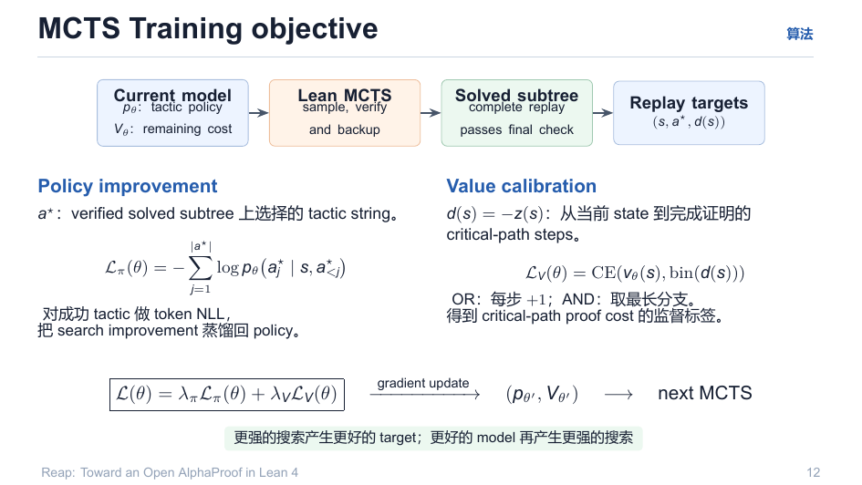
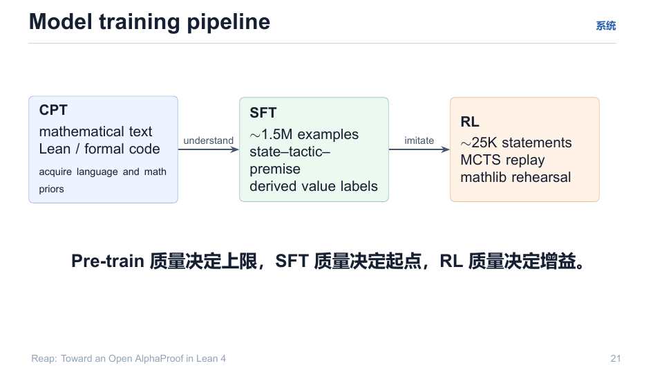

# 04 · 训练目标与三阶段管线

> 搜索产生的只是数据；**训练目标把搜索改进蒸馏回模型**。两路监督：策略 NLL + 价值分桶 CE。

回目录：[wiki 首页](README.md) ｜ 上一篇：[MCTS 核心](03-mcts-core.md) ｜ 下一篇：[Lean 原生搜索](05-lean-native-search.md)

---

## 1. Replay targets

最终确认后从树中取两个 target：

- $a^\star$：verified solved subtree 上选择的 tactic string（策略改进点）；
- $d(s) = -z(s)$：当前状态到完成证明的 **critical-path steps**（OR：每步 +1；AND：取最长分支——与 `V_AND = min` 是同一对象）。

## 2. 损失

$$
\mathcal{L}_\pi(\theta) = -\!\sum_{j=1}^{|a^\star|} \log p_\theta\!\left(a^\star_j \mid s, a^\star_{<j}\right)
$$

（对成功 tactic 做 token NLL——把 search improvement 蒸馏回 policy）

$$
\mathcal{L}_V(\theta) = \mathrm{CE}\big(v_\theta(s),\ \mathrm{bin}(d(s))\big)
$$

（categorical value head：把 `remaining cost` 分桶后被监督）

**联合**（梯度更新进下一个更强模型）：

$$
\mathcal{L}(\theta) = \lambda_\pi \mathcal{L}_\pi(\theta) + \lambda_V \mathcal{L}_V(\theta)
$$



> **回路不变量**：更强的搜索产生更好的 target；更好的 model 再产生更强的搜索。

## 3. 三阶段模型训练管线

```
CPT   数学文本 / Lean·formal code         → 获得语言与数学先验（上限）
SFT   ~1.5M examples（state–tactic–premise，含推导的 value 标签）  → 模仿（起点）
RL    ~25K statements（MCTS replay + mathlib rehearsal）          → 改进（增益）
```



**一句话口径**：Pre-train 质量决定上限，SFT 质量决定起点，RL 质量决定增益。

## 4. 本仓库的实际管线（v1-spec 口径）

`v1-spec/04-training.md` 是三阶段的参数化版本：

| 阶段 | 内容 | 关键点 |
|---|---|---|
| P0 SFT | 50k state_tactic_pairs + 课程正样本，LoRA r=32，lr 2e-4 | 跨模型冷启动；仅 adapter 可训练 |
| P1 GRPO | G=8 rollout/题，组内归一优势，KL guard β=0.02 | 用 server 返回 logprob 构造 importance ratio（FastAPI+transformers 选定理由：同一 logprob 可复现） |
| P2 TTTRL | 搜索期内每 (state,tactic,verdict) 事件在线小步；per-theorem adapter；≤16 步/题 | 对应 AlphaProof "contest loop" |

负样本：verdicts.jsonl 中 error/forbidden/timeout 对，$\hat r=-0.1$；**不做 soft-label**（防 reward hacking 泄漏）。

奖励锚点（`plan/05-rl-param-update.md`）：

$$
R = \begin{cases} 1 & \exists\ \text{kernel-verified proof script} \\ -\lambda_{\mathrm{exh}} & \text{budget exhausted} \\ \text{failure shaping} & \text{失败模式分开处理} \end{cases}
$$

---

## 溯源

- 演示文稿：`reap_tactic.pdf` 第 12、21 页；
- 生产规格：`v1-spec/04-training.md`（P0/P1/P2 完整参数）、`v1-spec/06-eval.md`（消融矩阵 A1–A6）；
- RL 理论细节：`plan/05-rl-param-update.md`（GAE、GRPO/PPO 变体、回滚门断）、`discussion/alphaproof-value-head/07_…md`（基于 MCTS backup 的 value target 推导）。
