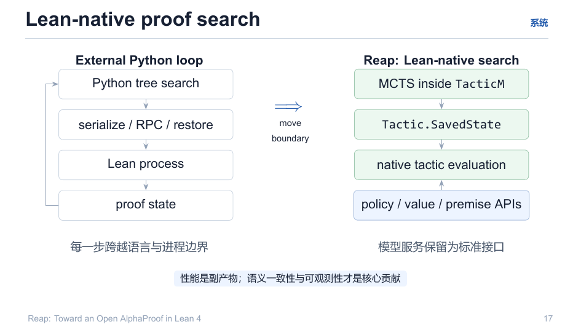

# 05 · Lean 原生搜索 vs 外环 Python 搜索

> 这是 Reap 架构上**最反直觉的决策**：搜索主循环在 Lean 内部（MCTS inside TacticM），而不是 Python 里造一个树、把状态序列化出来猜。

回目录：[wiki 首页](README.md) ｜ 上一篇：[训练目标](04-training-objective.md) ｜ 下一篇：[Rollout 管线](06-rollout-pipeline.md)

---

## 1. 两种形态对比

**外部 Python 循环**（常见做法 / 本仓库 `<v2.runner>` 之外的历史形态）：

```
Python tree search  →  serialize / RPC / restore  →  Lean process
（每步跨越语言与进程边界：状态进出、动作进出、上下文重放）
```

**Reap 的 Lean-native 搜索**：

```
MCTS inside TacticM
  • native tactic evaluation（验证动作原生执行，不经过 JSON 往返）
  • Tactic.SavedState 边界
  • 证明状态保留在 Lean 内（lean 侧直接 get/set）
```



## 2. 各层怎么分工

| 层 | 职责 | 边界 |
|---|---|---|
| **Lean 侧** | 树、状态、验证器、MCTS 核心、proof state 快照 | `Tactic.SavedState`（进=快照，出=重建） |
| **模型服务** | policy / value / premise API | OpenAI 兼容 HTTP 端点（标准接口） |

- CPU 侧依赖 GPU 侧三个端点：`/v1/chat/completions`（policy，含 logprob）、`/value`（value head）、`/ttt_step`（TTT 更新）+ `/adapter/snapshot|restore`；
- CPU 侧**只依赖契约**，不关心 GPU 内部（`new-v1-gather-source-code-cpu/README.md`）。

## 3. 为什么值得：性能是副产物，语义一致才是核心贡献

1. **语义一致性**：saved state 复原后，上下文、隔离、假设完全等价——不存在"序列化丢信息"造成的伪病态状态；
2. **可观测性**：tree、value、visit、premise 与 wall-clock trace 全部可导出——每次失败都是一个工件（artifact），不浪费；
3. **无假阳性奖励**：搜索成功只是 candidate，replay + final kernel check 之后才算（见 [06](06-rollout-pipeline.md)）。

> 硬件上：Lean 侧加载便宜（`reap-lean` 容器），模型服务保持标准接口——换模型不动核心，换搜索不动模型。

## 4. 本仓库的工程落点

| 仓库部件 | 说明 |
|---|---|
| `new-v1-gather-source-code-cpu/` | 上游 Reap Lean 源码实体归集（`reap-upstream/`），加 V1 训练扩展（`reap-training/Reap.Training`）与薄 Python 驱动（`python-driver/`，只做编排） |
| `reap-mcts-lean-v2-code-1/` | V2 最小骨架：`lean-v2/`（Eff/MetaActions/Tower）按容器编译；`v2/runner.py` 用 **mock policy** 走元动作循环 |
| `app/` | GPU 侧服务：`policy_server.py`（policy+value+TTT）、`value_head.py`、`v1_run.py` |

**边界纪律**：Lean 侧禁止嵌入模型实现（端点即契约）；Python 侧禁止模拟验证器（验证只在 Lean）。

---

## 溯源

- 演示文稿：`reap_tactic.pdf` 第 17 页；
- CPU 侧归集：`new-v1-gather-source-code-cpu/README.md`（目录与端点契约）；
- 术语与 hook：`explain/reap-mcts-lean-v1/01-architecture.md`（保留/剪枝/新增差集）、`explain/reap-mcts-lean-v2/02-action-space.md`。
