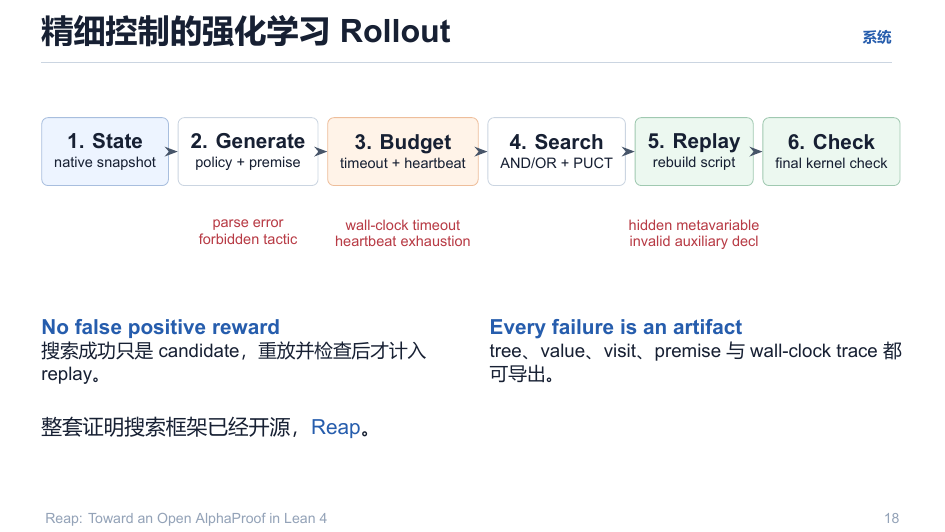

# 06 · Rollout 管线：六步与失败分类

> 训练收益的全部可信度来自这条管线的纪律：**No false positive reward ／ Every failure is an artifact。**

回目录：[wiki 首页](README.md) ｜ 上一篇：[Lean 原生搜索](05-lean-native-search.md) ｜ 下一篇：[模型与价值头](07-model-and-value.md)

---

## 1. 六步流水线

| # | 步骤 | 做什么 | 失败信号 |
|---|---|---|---|
| 1 | **State** | native snapshot（`Tactic.SavedState`） | parse error / forbidden tactic |
| 2 | **Generate** | policy 给出候选 + premise 检索 | 模型不可达（致命，走 retry ≤2） |
| 3 | **Budget** | wall-clock timeout + heartbeat | 超时 / heartbeat exhaustion |
| 4 | **Search** | AND/OR + PUCT 树扩展 | hidden metavariable / invalid aux decl |
| 5 | **Replay** | 重建完整证明脚本（rebuild script） | 重放不一致 |
| 6 | **Check** | 最终 kernel check（`checkProof`） | unassigned / sorry / aux 核验失败 |



## 2. 为什么"重放后再查"而不是"搜到即奖励"

搜索中的"成功"只是 **candidate**；只有重放并内部核查通过的才计入 replay 与奖励。这堵住了多类捷径：`sorry`/`admit`、unassigned goals、aux-decl metavariable、辅助证明内核失败——**不存在被 reward 的假阳性**。

对应的结构化判定（见 [01](01-lean-environment.md) §2）在 V1 中被落成 `Verdict.lean`（`EvalResult → verdict` 字符串枚举 + 消息摘要），`RolloutSink` 每节点发射：

```json
{"kind":"node","tactic":"...","logp":-12.31,"verdict":"ok|error|timeout|solved",
 "value":0.52,"diff_visit":1,"parent_key":"...","state_key":"..."}
```

## 3. 样本面（训练侧看到的世界）

| 文件 | 内容 | 用途 |
|---|---|---|
| `solutions.jsonl` | kernel 验证通过的 proof script + 树 | 正样本（w=1） |
| `failures.jsonl` | 失败轨迹：错误/超时/违规 | 负样本（$\hat r=-0.1$） |
| `rttt_buffer.jsonl` | 流式 (state, tactic, verdict) 事件 | 在线 TTT 更新 |

要点：`checkProof` 通过 = 正标签（**不以"Lean 内部无报错"代替**）；树中状态按 `stateKey`（pp-goals JSON hash）去重，重复状态合并子节点（prior 相加）——训练采样以去重后的边为准（防重复计数膨胀）。

## 4. 断点续传与确定性

- 每个 batch：`state/<batch>/<id>.done` 原子标记 + `out/<batch>/solutions.jsonl` append-only；
- 中断恢复：跳过 `.done`，其他追加；任务生命周期 `ENQUEUE → LOAD → PER_TASK(检查点) → DONE`；
- 采样预算默认：rollout `max_nodes=64 / max_steps=64 / n=6 / 200s`；Diff 标定用减档 `16/16/3/40s`。

---

## 溯源

- 演示文稿：`reap_tactic.pdf` 第 18 页；
- 生命周期与日志：`explain/reap-mcts-lean-v1/01-architecture.md`（BatchSolver 状态机）、`02-rollout-sink.md`、`03-batch-solver.md`；
- 质量门：`explain/reap-mcts-lean-v1/05-quality-gates.md`；规格：`v1-spec/02-mcts-verifier.md`。
