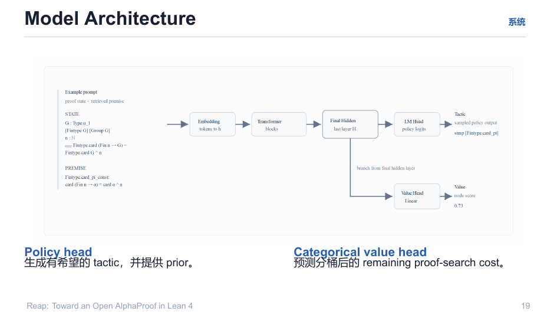

# 07 · 模型与价值头

> 模型 = 一个**双头网络**：Policy head（生成有希望的 tactic + prior）与 **Categorical value head**（预测分桶后的剩余 proof-search cost）。

回目录：[wiki 首页](README.md) ｜ 上一篇：[Rollout 管线](06-rollout-pipeline.md) ｜ 下一篇：[分布式基础设施](08-distributed-infrastructure.md)

---

## 1. 标准形态（演示文稿版本）



- **Policy head**：生成候选 tactic，并提供 prior（$\log p_\theta(a|s)$ → token-level logprob，端上和；
- **Value head**：对"剩余证明长度"做**分桶分类**（categorical）——alpha-proof 的量化口径；与 policy 共享 backbone；
- **训练口径**：$\mathcal{L}_V = \mathrm{CE}(v_\theta(s), \mathrm{bin}(d(s)))$（见 [04](04-training-objective.md)）。

> 语义澄清：价值网络是对**状态**的估计（"该局面 → 后续最优下最终可证概率/剩余代价"）；对"走法"的派生量是 $Q(s,a) = r + \gamma V_\phi(s')$——两者不要混。详见 `explain/1-价值头的作用.md`（含"价值头 vs 聊天式价值模型"区别：后者不可微、不可在线更新；$V_\phi$ 是**可微回归器**，可在 `/ttt_step` 里持续微调）。

## 2. 本项目实现的标量价值头（`app/VALUE_HEAD.md`）

与 REAL-Prover 共享 backbone 的独立连续 value head；借鉴 nanoproof 训练信号（验证成功的轨迹、剩余深度、MCTS backup return）：

```
backbone 最后一个有效 token hidden (H)
  → Linear(H, 256) → SiLU → Linear(256, 1) → Tanh → V(s) ∈ [-1, 1]
```

- `H` 从模型配置动态读取（不再硬编码 4096）；backbone BF16，head FP32；
- 训练目标：验证器产生的 normalized discounted return；或传 `proof_depth`，按 `-min(depth,64)/64` 转换。

**HTTP 输出两种模式**：

| 模式 | 输出 | 适配 |
|---|---|---|
| `scalar`（默认） | `score = -V(s)` | 本项目 `v1-spec/01-policy-value.md` |
| `distance` | 映射到 `[1, max_distance]` 正距离 | nanoproof / verified-collector 风格（Lean 侧再取负） |

两模式共享同一套 head 参数；模式与 `max_distance` 写入 checkpoint 元数据，恢复时校验。

## 3. 训练方式（离线 / 在线）

**离线**（`train_value_head.py`，冻结 backbone）：JSONL 每行给显式监督字段之一：

```json
{"prompt":"<Lean state>","value_target":0.35}
{"state":"<Lean state>","proof_depth":8}
{"state":"<Lean state>","value_target":-8,"target_kind":"nanoproof"}
{"states":["s0","s1"],"rewards":[0.0,1.0],"gamma":0.99}
```

脚本**只使用显式监督字段**；不会默认把旧的 `value.score` 当标签（防止用随机 value 预测自举成真值；确要迁移旧数据加 `--allow-score`）。

**在线（RTTT 内）**（`policy_server.py` 的 `/ttt_step`）：TD(0)/MC 目标

$$
\delta_t = r_t + \gamma V_\phi(s_{t+1}) - V_\phi(s_t),\qquad \mathcal{L}_{\mathrm{TD}} = \mathbb{E}[\delta_t^2]
$$

**两套参数、两类信号、两种时间尺度**的耦合：策略 LoRA 管"提什么动作"，价值头管"这状态值不值得继续扩"；价值头每收一次真实 Lean 判证回馈就做一次回归修正——把搜索对"好分支"的信任不断向真实验证对齐。

## 4. 配置锚点（v1-spec/01）

- Policy：`FrenzyMath/REAL-Prover`（Qwen2.5-Math-7B 微调，BF16）+ LoRA（r=32, α=64, dropout=0.05）；
- 推理：FastAPI 走 OpenAI 兼容端点，`n=6, temperature=0.99, max_tokens=1024, logprobs=true`（**必须返回 token-level logprobs**，reap 端求和 = `log π(a|s)`）；
- 不依赖 vLLM（gfx1100 不在 vLLM ROCm 官方支持矩阵）。

---

## 溯源

- 演示文稿：`reap_tactic.pdf` 第 19 页；
- 落地说明：`app/VALUE_HEAD.md`（模型结构/两模式/离线训练/启动命令）、`v1-spec/01-policy-value.md`；
- 原理：`explain/1-价值头的作用.md`（MDP 嵌入、PUCT 中 Q 的作用、围棋胜率同构）、`discussion/alphaproof-value-head/07_AlphaProof从零到完整机制_搜索_Value与TTT.md`。
