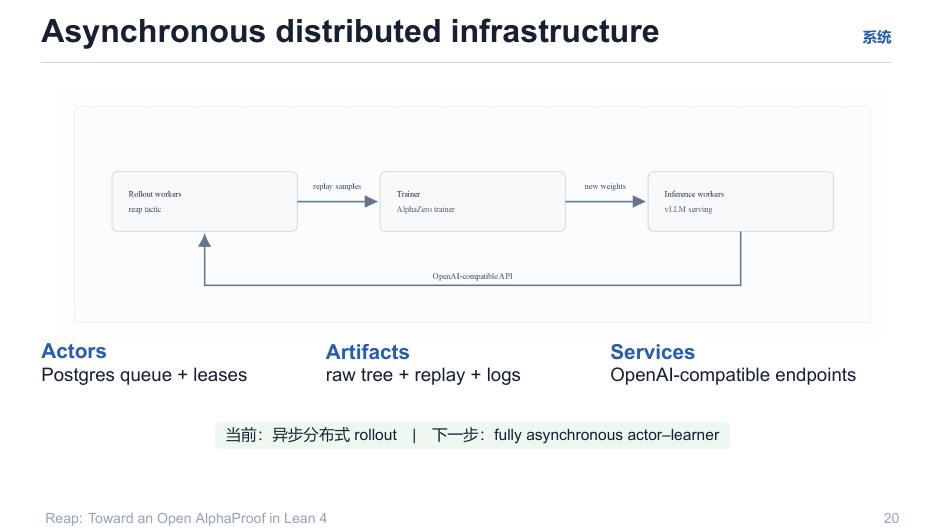

# 08 · 分布式基础设施：Actor / Artifacts / Services

> 当前形态：**异步分布式 rollout**；下一步：**fully asynchronous actor–learner**。

回目录：[wiki 首页](README.md) ｜ 上一篇：[模型与价值头](07-model-and-value.md) ｜ 下一篇：[结果](09-results.md)

---

## 1. 三角色分层

```
Actors            → 计算节点：跑 MCTS / rollout（Lean 侧 + policy client）
Artifacts         → 产物存储：raw tree + replay + logs（文件面，可检查）
Services          → 服务：Postgres queue + leases（任务分发）；OpenAI-compatible endpoints（模型）
```



- **Postgres queue + leases**：任务领取带租约，崩溃任务租约过期自动重新可见（幂等 + 断点续传的分布式版本）；
- **标准接口**：模型服务就是 OpenAI 兼容端点——CPU 侧只吃契约（见 [05](05-lean-native-search.md) §2）；
- **Artifacts 为观察而生**：每个 rollout 的树、value、visit、premise、wall-clock trace 均落盘——失败即工件（见 [06](06-rollout-pipeline.md)）。

## 2. 本仓库的容器/工程落点

| 部件 | 内容 |
|---|---|
| `app/requirements.lock` | GPU 侧依赖（transformers/peft/fastapi 等） |
| `docker/reap-lean.Dockerfile` | CPU Lean 镜像（MCTS-v1）——`.github/workflows/docker.yml` 在 `new-reap-mcts-ttt-public` 分支 push 时自动构建并推送 `ghcr.io` |
| `docker/lean.Dockerfile` | Lean 工具链镜像 |
| `docker/train.Dockerfile` | 训练容器 |
| `app/v1_run.py --workers N` | 每 worker = 1 个 `lean --run v1_driver` 子进程（policy_server 无状态 http，可安全并发） |

## 3. 服务约定（OpenAI 兼容面）

```
POST /v1/chat/completions   {prompt, n, temperature}           → [{text, logprobs}]
POST /value                 {prompt}                           → {"score": float}
POST /ttt_step              {items:[{prompt,target,r,logprob_old}]} → {loss,kl,steps}
POST /adapter/snapshot      /  /adapter/restore
POST /health
```

- logprob 必须是 token-level（reap 主端求和 – 这决定了选 FastAPI+transformers 而非 llama.cpp/vLLM）；
- TTT 节流：仅当 $\Delta \log p > \varepsilon$ 且网络时延 < 2s 时触发（CPU→GPU 同步）；
- adapter 原子换版：训练完成即换 `adapter_id`，server reload 原子化；`snapshot/restore` 用于 eval 前恢复/P2 逐题 adapter 管理。

## 4. 失败模式与可恢复性

任务级：LLM 调用 ≤2 次重试 + 300s 超时；每题 `maxSteps=64` 默认、`--per-task-timeout 300s`；断点 = `.done` 标记 + append-only 输出（见 [06](06-rollout-pipeline.md) §4）。部署环境提供模型路径、容器镜像、服务地址与凭据——**不进仓库**（`PUBLICATION.md`）。

---

## 溯源

- 演示文稿：`reap_tactic.pdf` 第 20 页；
- 端点契约与并发：`new-v1-gather-source-code-cpu/README.md`、`v1-spec/README-render.md`；
- 回滚/门断：`v1-spec/04-training.md` §4.5、`v1-spec/06-eval.md`。
