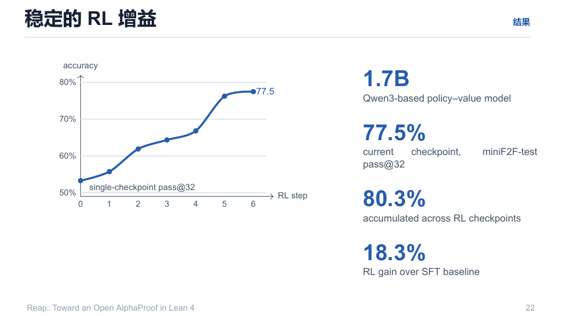
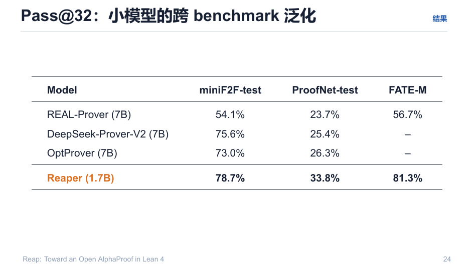
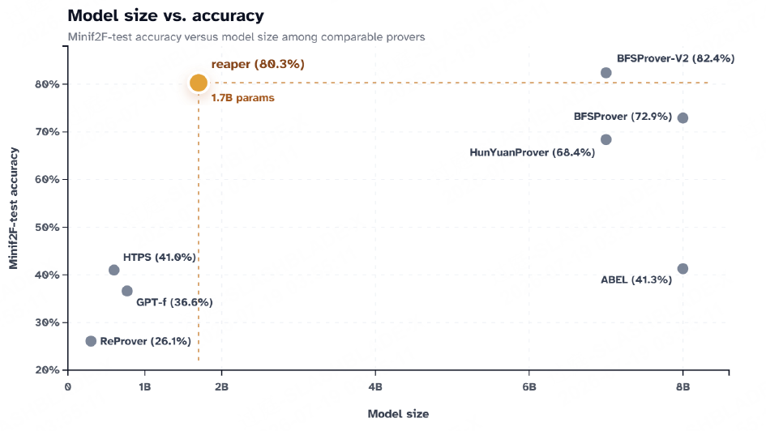
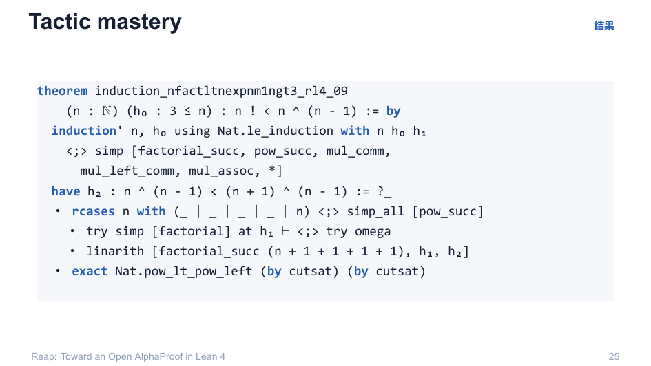
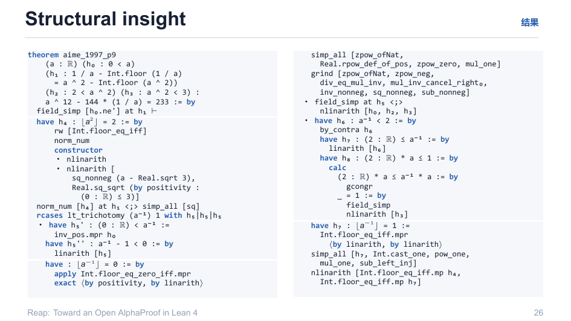

# 09 · 结果与证据

> 核心数字：**1.7B Qwen3-based policy–value 模型，single-checkpoint pass@32 = 77.5%，累计 80.3%，RL 相对 SFT 增益 18.3%。**

回目录：[wiki 首页](README.md) ｜ 上一篇：[分布式基础设施](08-distributed-infrastructure.md) ｜ 下一篇：[开放范围与下一步](10-open-and-next.md)

---

## 1. 稳定 RL 增益

```
准确率
  80% ┤                        ● (80.3% 累积)
  70% ┤     ●──────── 77.5% 当前 checkpoint, pass@32
  50% ┤  ●─ 单 checkpoint pass@32
      └──┬──┬──┬──┬──┬──┬──┬
        RL 步 0  1  2  3  4  5  6
```

- 单 checkpoint @32：77.5%；跨 RL checkpoint 累积：80.3%；
- **RL 增益 = 18.3% over SFT baseline**（miniF2F-test）——增益稳定、无退化。



## 2. Pass@32：小模型跨 benchmark 泛化

| Model | miniF2F-test | ProofNet-test | FATE-M |
|---|---|---|---|
| REAL-Prover (7B) | 54.1% | 23.7% | 56.7% |
| DeepSeek-Prover-V2 (7B) | 75.6% | 25.4% | – |
| OptProver (7B) | 73.0% | 26.3% | – |
| **Reaper (1.7B)** | **78.7%** | **33.8%** | **81.3%** |



模型规模 vs 精度关系：



**读法**：miniF2F 88.9%（累计 80.3%）+ ProofNet + FATE-M 同时上升意味着**泛化而非过拟合**；1.7B 在 ProofNet-test 上反而比 7B 系更好。

## 3. 定性证据 1：Tactic mastery（战术精通）

`induction_nfactltnexpnm1ngt3_rl4_09`：多步归纳 + `simp_all` 链 + `linarith [factorial_succ ..., h₁, h₂]` 组织。



## 4. 定性证据 2：Structural insight（结构洞察）

AIME 1997 P9（实数方程整数部分问题）：模型切开 $\lfloor a^{-1}\rfloor$ 分支、用 `norm_num [h₄] at h₁ <;> simp_all [sq]` 统一，最后 `nlinarith [Int.floor_eq_iff.mp h₄, Int.floor_eq_iff.mp h₇]` 收束——正是"结构上分离、代数上合并"的证明风格。



---

## 溯源

- 演示文稿：`reap_tactic.pdf` 第 22–26 页；
- 本仓库的目标口径：`plan/06-evaluation.md`（solve@B、value 相关性 `val_corr`、归一成本）、`v1-spec/06-eval.md`（防泄漏的 E/F 集合 + A1–A6 消融矩阵）。
