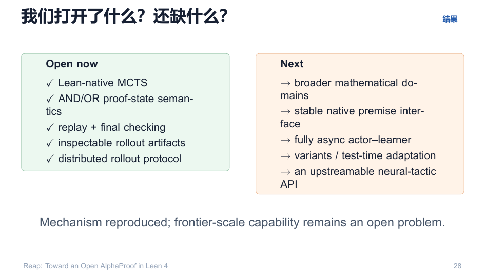
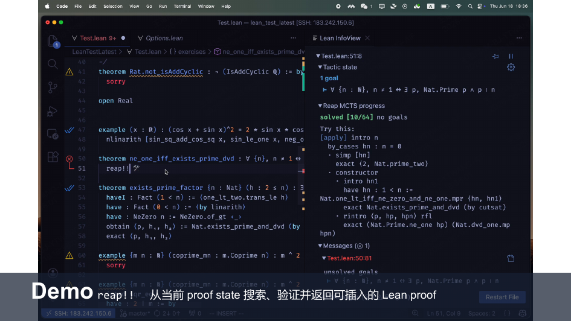

# 10 · 开放范围与下一步：机制已复现，规模仍是未知

> **Mechanism reproduced; frontier-scale capability remains an open problem.**

回目录：[wiki 首页](README.md) ｜ 上一篇：[结果](09-results.md) ｜ 下一篇：[仓库地图](11-repo-map.md)

---

## 1. 已开放的（Open now）

| 已实现 | 落地位置 |
|---|---|
| ✅ Lean-native MCTS | `Reap.TreeSearch` / `Reap.Tactic`（Lean） |
| ✅ AND/OR proof-state semantics | `backupValueTowardsMin` / V1 判定 |
| ✅ replay + final checking | `Reap.Tactic.Step.checkProof` + RolloutSink |
| ✅ inspectable rollout artifacts | `solutions.jsonl` / `failures.jsonl` / 树导出 |
| ✅ distributed rollout protocol | Postgres queue + leases + OpenAI 兼容端点 |

## 2. 还没做的（Next）

- 🌍 broader mathematical domains（更大 mathlib 面）；
- 🧩 stable native premise interface（premise 检索的稳定原生接口——目前按端点契约走）；
- ⚙️ fully async actor–learner（当前是异步 rollout，下一步去掉学习者同步等待）；
- 🧪 variants / test-time adaptation（课程变体 + 测试时自适应）；
- 🔁 an upstreamable neural-tactic API。

## 3. 一句话 demo

`reap!!`：从当前 proof state 搜索、验证、返回**可插入的 Lean proof**——整条"搜索即工具"的闭环在编辑器内立即可用。

## 4. 本仓库的版本分层（对"下一步"的回应）

| 层 | 定位 | 内容 | 关键设计 |
|---|---|---|---|
| **upstream** | 编辑器内 `reap!!` | 消费型，给人按 | 权威同步、不魔改 |
| **V1 `Reap.Training`** | 批量数据生成器 + RTTT 训练环 | 无 UI、`BatchSolver`、`RolloutSink`、RTTT 挂钩 | 见 `explain/reap-mcts-lean-v1/` |
| **V2 `Reap.Agent`** | 元层证明智能体 | 动作空间升到元层：`Eff` 通道 / 元状态 / 元动作 / 塔上升 | 四不变量（自指切开、证明≠计算、塔上升验证门、动作类型检查合法） |

V1/V2 关系：**层叠而非分叉**——V2 = V1 ⊕ {Eff, MetaState, MetaActions, Tower}，不改 V1 核心算法（`explain/reap-mcts-lean-v2/00-overview.md`）。

## 5. 我们希望你带走的

研究 "**why RL works**" 需要可实验的闭环：

- search inside Lean（搜索在 Lean 内）
- inspect every rollout（观察每个 rollout）
- learn with small models（用 1.7B 学习）

---

## 溯源

- 演示文稿：`reap_tactic.pdf` 第 27–29 页；
- 深挖：`explain/7-reap-v1-v2.md`、`explain/8-v2-math-drive.md`、`plan/07-roadmap.md`（里程碑/硬件/风险）、`plan/09-test-time-training.md`、`plan/10-recursive-self-improvement.md`。
